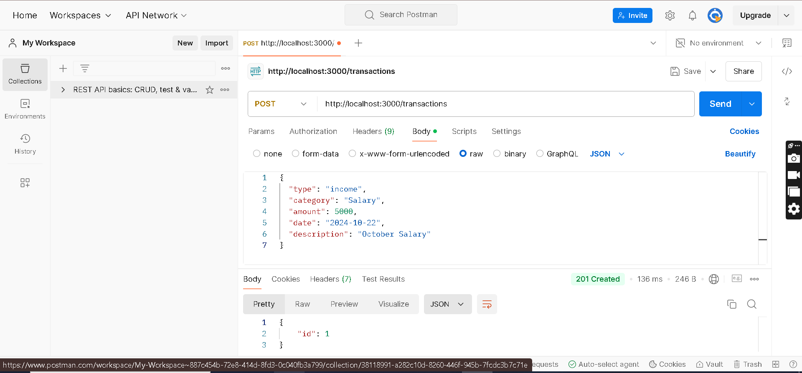
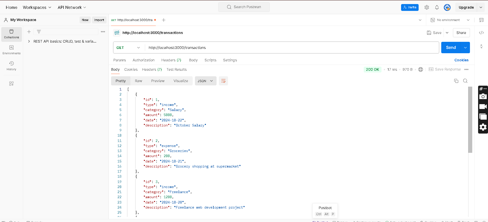
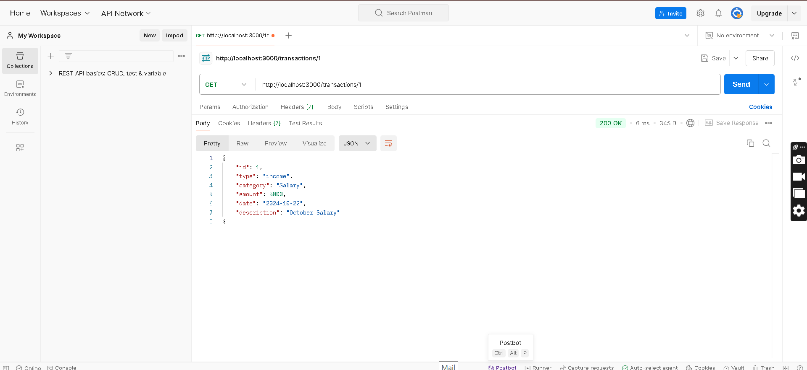
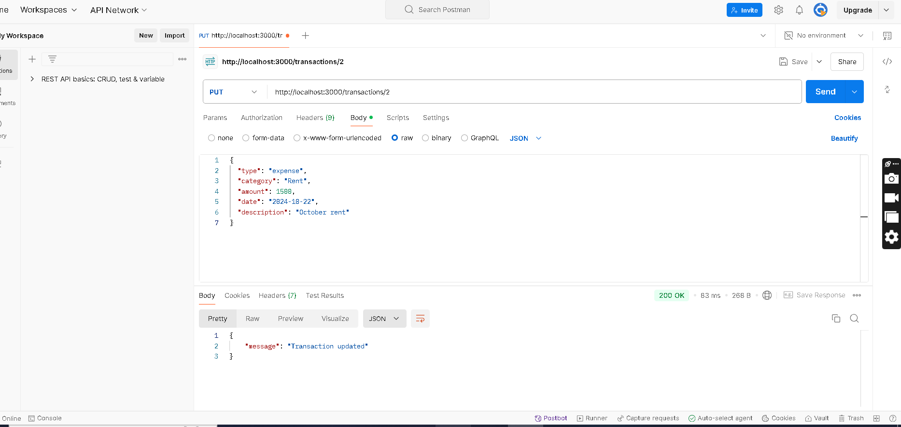
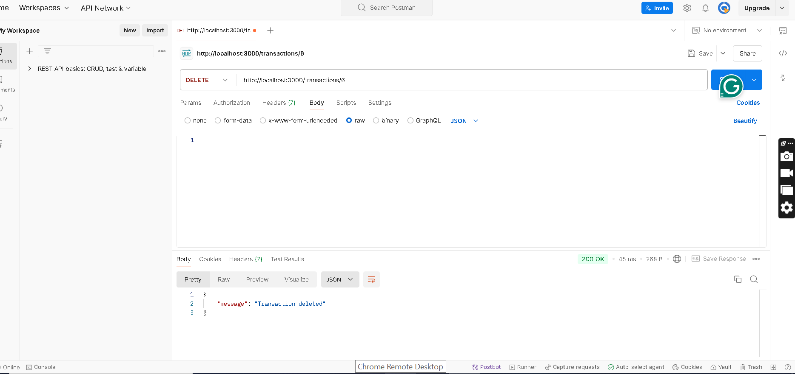
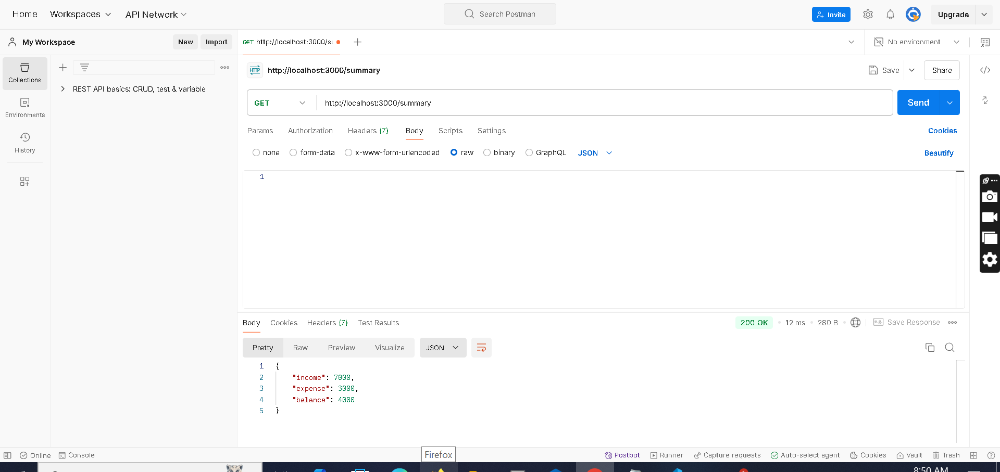

<<<<<<< HEAD
# FlowwAi__Backend_Assignment
=======
# Personal Finance API

A RESTful API to manage personal financial records, including income, expenses, and balance summary.

## Endpoints

### Add a new transaction
- **POST /transactions**
- **Body**:
    ```json
    {
      "type": "income",
      "category": "Salary",
      "amount": 5000,
      "date": "2024-10-22",
      "description": "October Salary"
    }
    ```

### Get all transactions
- **GET /transactions**

### Get a transaction by ID
- **GET /transactions/:id**

### Update a transaction by ID
- **PUT /transactions/:id**
- **Body**:
    ```json
    {
      "type": "expense",
      "category": "Rent",
      "amount": 1500,
      "date": "2024-10-22",
      "description": "October rent"
    }
    ```

### Delete a transaction by ID
- **DELETE /transactions/:id**

### Get summary of income and expenses
- **GET /summary**

## Setup and Run

1. Clone the repository.
2. Install dependencies: `npm install`.
3. Run the server: `npm start`.

## Testing

Test the API using Postman with the provided endpoints.


## API Testing Screenshots

### POST /transactions



### GET /transactions



### GET /transactions by id



### PUT /transactions by id



### DELETE /transactions by id



### GET /summary


>>>>>>> b78507c (commit)
